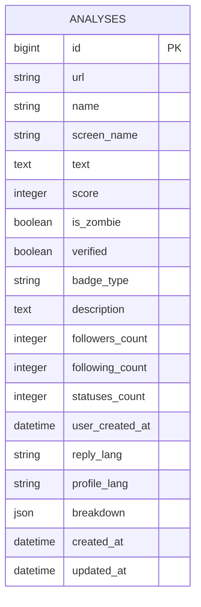

# 📊ER図
#### ✅X APIで取得したデータの保存のみになります。 ✅保存したデータを利用して解析します。

```mermaid
erDiagram
    ANALYSES {
        bigint id PK
        string url
        string name
        string screen_name
        text text
        integer score
        boolean is_zombie
        boolean verified
        string badge_type
        text description
        integer followers_count
        integer following_count
        integer statuses_count
        datetime user_created_at
        string reply_lang
        string profile_lang
        json breakdown
        datetime created_at
        datetime updated_at
    }
```