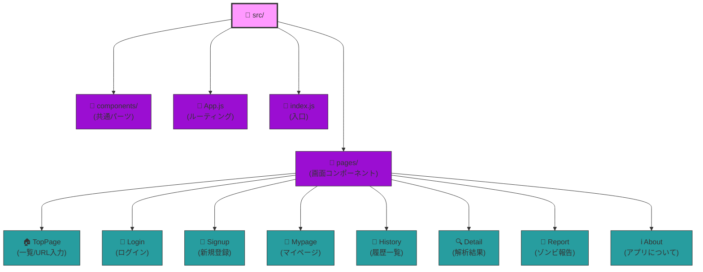

```mermaid
graph TD
    %% ノード定義（絵文字を入れて分かりやすく）
    Root["📁 src/"]
    
    Pages["📁 pages/ <br/>(画面コンポーネント)"]
    Comp["📁 components/ <br/>(共通パーツ)"]
    App["📄 App.js <br/>(ルーティング)"]
    Index["📄 index.js <br/>(入口)"]

    %% src直下の間隔を広げる（矢印を長くする）
    Root -----> Pages
    Root ----> Comp
    Root ----> App
    Root ----> Index

    %% pages配下の展開（ここも少しゆったりと）
    Pages ---> Top["🏠 TopPage<br/>(一覧/URL入力)"]
    Pages ---> Login["🔑 Login<br/>(ログイン)"]
    Pages ---> Signup["📝 Signup<br/>(新規登録)"]
    Pages ---> Mypage["👤 Mypage<br/>(マイページ)"]
    Pages ---> History["📜 History<br/>(履歴一覧)"]
    Pages ---> Detail["🔍 Detail<br/>(解析結果)"]
    Pages ---> Report["📢 Report<br/>(ゾンビ報告)"]
    Pages ---> About["ℹ️ About<br/>(アプリについて)"]

    %% スタイリング（余白感を感じさせる明るい色）
    style Root fill: #f9f,stroke:#333,stroke-width:3px
    style Pages fill: #9b0ed2,stroke:#333
    style Comp fill: #9b0ed2,stroke:#333
    style App fill: #9b0ed2,stroke:#333
    style Index fill: #9b0ed2,stroke:#333
    style Top fill: #279d9fff,stroke:#333
    style Login fill: #279d9fff,stroke:#333
    style Signup fill: #279d9fff,stroke:#333
    style Mypage fill: #279d9fff,stroke:#333
    style History fill: #279d9fff,stroke:#333
    style Detail fill: #279d9fff,stroke:#333
    style Report fill: #279d9fff,stroke:#333
    style About fill: #279d9fff,stroke:#333
```