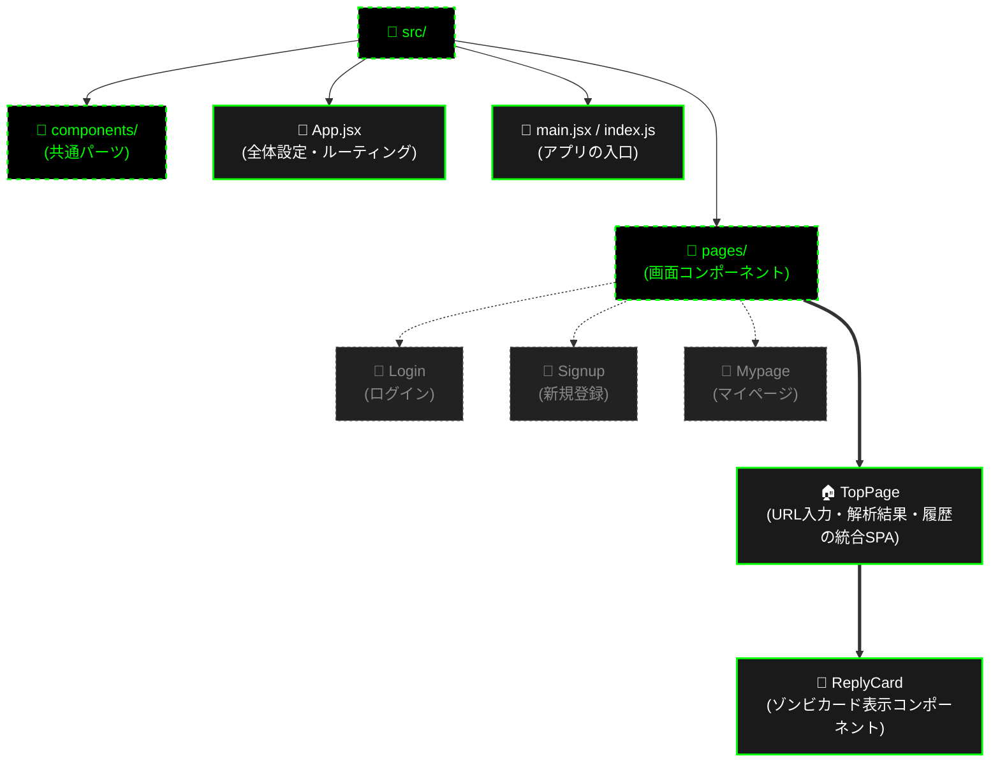

# 📱アプリ設計図
#### ✅ 最初は「入力」「結果」「履歴」と画面を分けていましたが、ユーザーの待ち時間とストレスをゼロにするため、TopPageにすべての機能を統合しました。 ✅ 「Login」「Signup」「Mypage」はアプリ拡張に伴い設計予定です。

```mermaid
flowchart TD
    %% ノード定義
    Root["📁 src/"]
    Pages["📁 pages/<br>(画面コンポーネント)"]
    Comp["📁 components/<br>(共通パーツ)"]
    App["📄 App.jsx<br>(全体設定・ルーティング)"]
    Index["📄 main.jsx / index.js<br>(アプリの入口)"]

    Root --> Index
    Root --> App
    Root --> Comp
    Root ---> Pages

    %% Pagesから各ページへの派生
    Pages ===> Top["🏠 TopPage<br>(URL入力・解析結果・履歴の統合SPA)"]
    Pages -.-> Login["🔑 Login<br>(ログイン)"]
    Pages -.-> Signup["📝 Signup<br>(新規登録)"]
    Pages -.-> Mypage["👤 Mypage<br>(マイページ)"]

    %% TopPageの配下
    Top ===> ReplyCard["🧩 ReplyCard<br>(ゾンビカード表示コンポーネント)"]

    %% サイバーパンク風スタイリング
    classDef default fill:#1a1a1a,stroke:#00ff00,stroke-width:2px,color:#fff;
    classDef folder fill:#000000,stroke:#00ff00,stroke-width:2px,color:#00ff00,stroke-dasharray: 5 5;
    classDef sub fill:#222222,stroke:#555555,stroke-width:1px,color:#888888,stroke-dasharray: 3 3;
    
    class Root,Pages,Comp folder;
    class App,Index,Top,ReplyCard default;
    class Login,Signup,Mypage,Report,About sub;
```