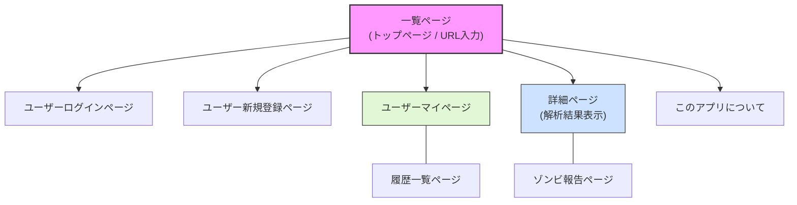

```mermaid
graph TD
    %% ノードの定義（ID[表示名]）
    Top["一覧ページ<br/>(トップページ / URL入力)"]
    Login["ユーザーログインページ"]
    Signup["ユーザー新規登録ページ"]
    Mypage["ユーザーマイページ"]
    Detail["詳細ページ<br/>(解析結果表示)"]
    About["このアプリについて"]
    History["履歴一覧ページ"]
    Report["ゾンビ報告ページ"]

    %% 遷移（線の定義）
    Top --> Login
    Top --> Signup
    Top --> Mypage
    Top --> Detail
    Top --> About

    Mypage --- History
    Detail --- Report

    %% スタイルの適用（色付け）
    style Top fill:#f9f,stroke:#333,stroke-width:2px
    style Mypage fill:#e1f7d5,stroke:#333
    style Detail fill:#cce2ff,stroke:#333
    
```