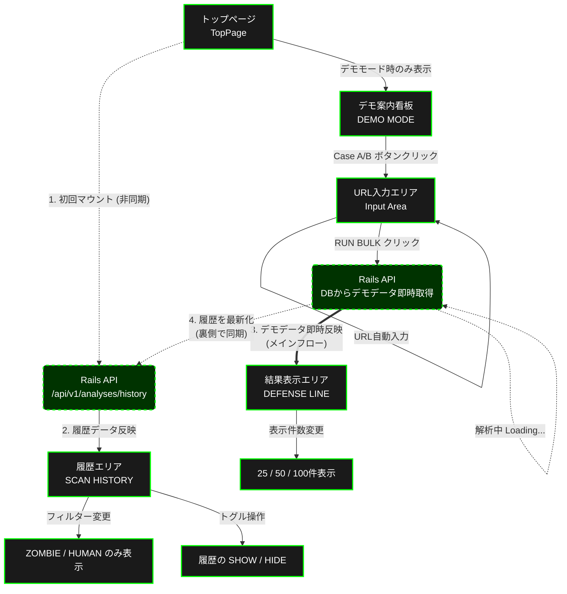
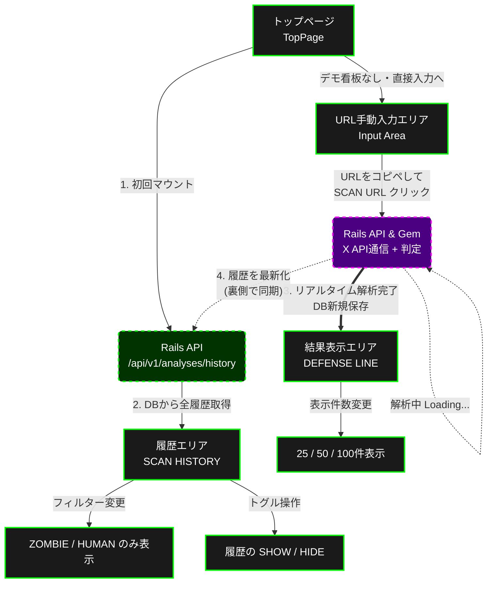

# 📺画面遷移図
### ✅お試し用のデモモードオンと本番用のデモモードオフの二つのモードがあります。 ✅環境変数 DEMO_MODE を導入しております。
## デモモードオン
#### 📍X API取得に料金がかかるため、課金システムの体系が完成するまでは、お試し用のURL（実際のポストのURL）を用意してお試しいただける様にしております。

## デモモードオフ
#### 📍デモモードをオフにすることで、X APIを取得して解析テストを行うことができます。
